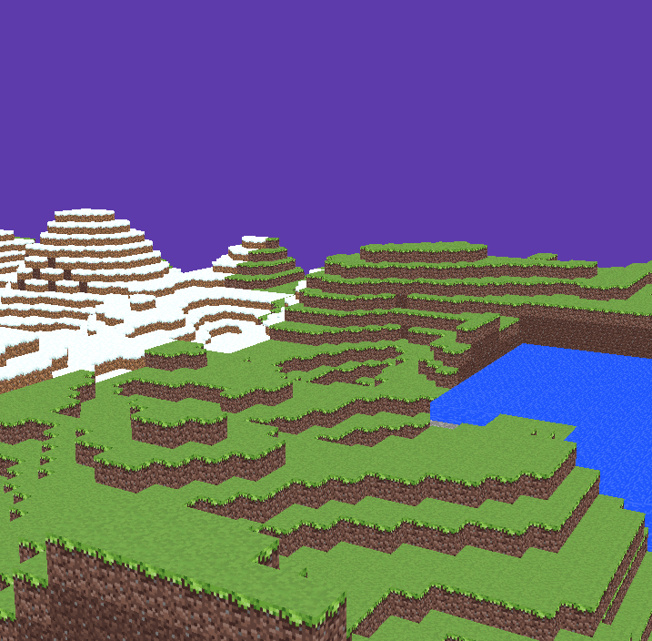

# Yet Another Minecraft Clone in C++

Minecraft-like block-world game coded entirely in C++ w/ OPENGL, without game engine. 

- Infinite Terrain Generation with 6 different biomes
- Efficient chunk based rendering

This repository is still in active development, aiming to release preview v0.1.0 in December.

I aim to make this project more than just a copy of minecraft, by adding more realism in graphics and terrain generation logic.

